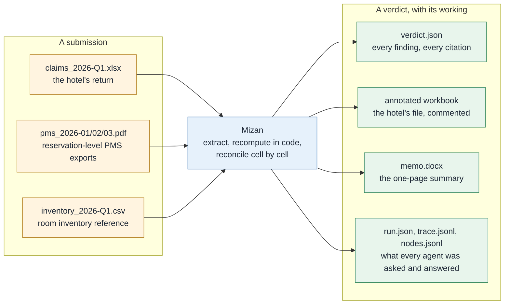
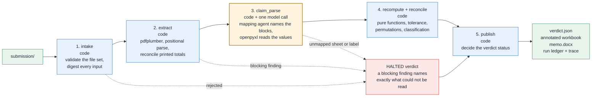
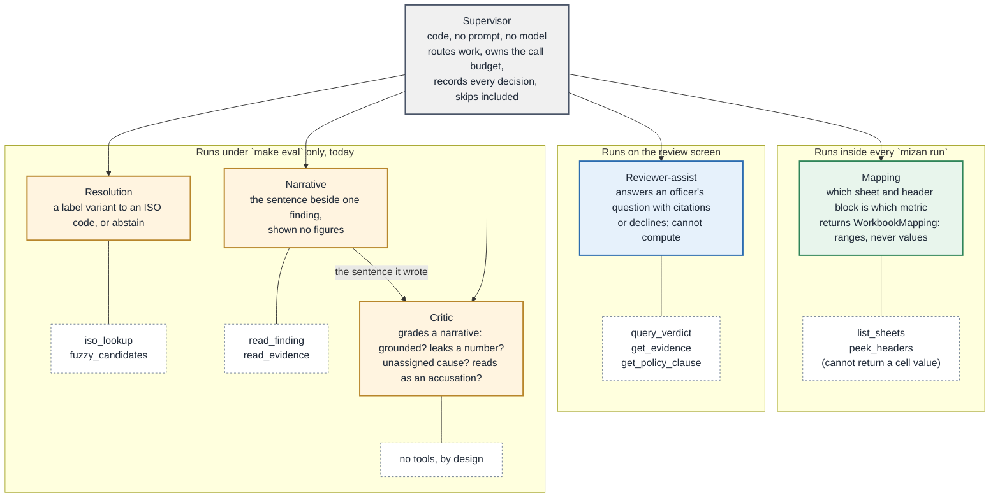
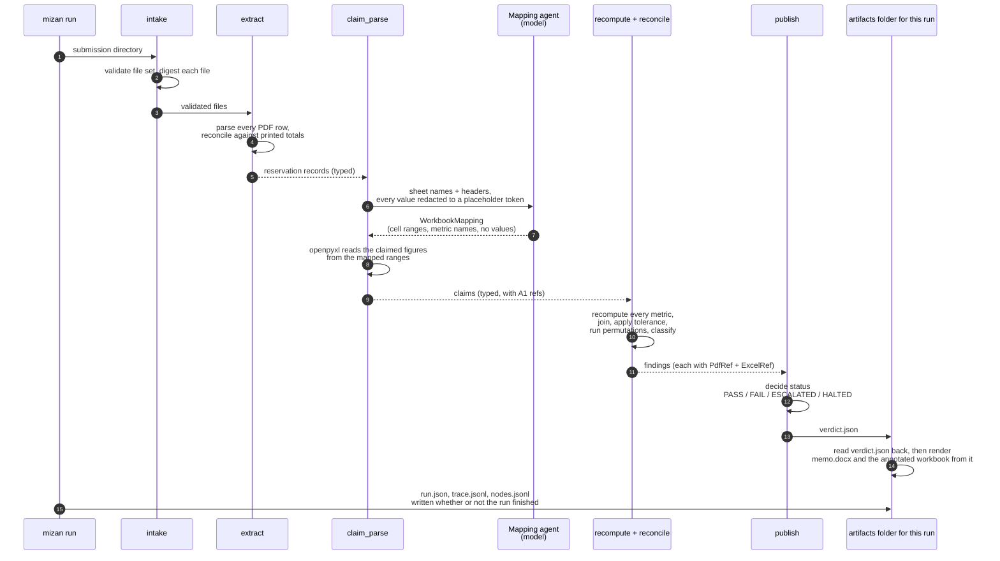

# Mizan, an agentic reconciliation and verification system (POC)

> **Mizan** (ميزان): the scales. The system weighs what a hotel *claims* against what its own
> property-management-system reports *show*, and shows its working.

**Classification: Green. Synthetic data only.** No real hotel or guest data enters this repository.

## What this repository is for

A hotel submits a periodic statistical return as an Excel workbook: occupancy, room-nights, guests
by nationality. The same hotel's property management system (PMS) can export the reservation-level
PDF reports those figures were supposed to be built from. Mizan reads both, recomputes every metric
from the PDFs in plain code, compares the result to the workbook cell by cell, and reports each
discrepancy **with evidence**: a PDF page and row range on one side, an Excel cell on the other.

The engineering point it exists to demonstrate is narrower than "an AI that checks spreadsheets".
Language-model agents are used only where the problem is genuinely linguistic (which sheet is
which metric, what a country label means, how to phrase a finding), and **no model output can ever
reach a calculation**. That wall is enforced by static checks in CI, not by convention.



## Design principle: deterministic core, agentic edges

Everything below is subordinate to this one diagram. The agents on the left read layouts, labels
and language and hand across **keys and references**: a cell range, a country code, a permutation
id. The core on the right performs every calculation and accepts only typed records. Two CI guards
make the boundary a build failure rather than a review comment.

```mermaid
flowchart LR
    classDef edge fill:#fff4e0,stroke:#b8862b,stroke-width:2px,color:#1f2937
    classDef core fill:#e6f1fb,stroke:#2b6cb0,stroke-width:2px,color:#1f2937
    classDef guard fill:#fde8e8,stroke:#c53030,color:#1f2937
    classDef handoff fill:#ffffff,stroke:#4a5568,stroke-dasharray:4 3,color:#1f2937

    subgraph EDGE["The agentic edge: reads layouts, labels, language"]
        direction TB
        MAP["Mapping agent"]:::edge
        RES["Resolution agent"]:::edge
        NAR["Narrative agent"]:::edge
        REV["Reviewer-assist agent"]:::edge
        CRI["Critic agent"]:::edge
    end

    HAND["keys and references only<br/>cell range, country code, permutation id<br/><b>never a number</b>"]:::handoff

    subgraph CORE["The deterministic core: performs every calculation"]
        direction TB
        EXT["tda.extract<br/>the positional PDF parser"]:::core
        MET["tda.metrics<br/>pure functions, no I/O"]:::core
        REC["tda.reconcile<br/>join, tolerance, classification"]:::core
    end

    G1["import_guard.py<br/>tda.metrics and tda.reconcile may not import<br/>a model client or do file I/O"]:::guard
    G2["agent_schema_lint.py<br/>no agent output contract may declare<br/>a numeric field beyond a page or row citation"]:::guard

    EDGE --> HAND --> CORE
    G1 -. enforced in CI .-> CORE
    G2 -. enforced in CI .-> EDGE
```



`tools/guard/import_guard.py` walks the AST of `tda.metrics` and `tda.reconcile` and refuses a
model import or filesystem I/O in either package. `tools/guard/agent_schema_lint.py` walks every
agent's declared output contract and refuses a numeric field beyond a page or row citation.
`tests/arch/` proves both guards actually work by feeding each one code that deliberately breaks
its rule.

## How a run works, end to end

Five nodes, run sequentially by a LangGraph pipeline. A submission that cannot be verified halts
rather than guesses: an unreadable row, an unmapped sheet or a country label nobody taught the
system all produce a blocking finding and a `HALTED` verdict, never an inferred value standing in
for one that could not be read.



| Node | What runs | What goes in | What comes out |
|---|---|---|---|
| `intake` | code | the submission directory | a validated file set with a SHA-256 per file, or a rejection with a reason code |
| `extract` | code | the PDF reports | reservation-level records, reconciled against the totals printed on each report, or a blocking finding |
| `claim_parse` | code + one model call | the Excel workbook | which sheet and header block is which metric (the mapping agent), then the claimed figures read by `openpyxl` with no model involved |
| `recompute + reconcile` | code | the records and the claims | every metric recomputed from scratch, joined against the claim, classified against `policy.yaml` |
| `publish` | code | everything above | the verdict status, decided by `Verdict`'s own invariants |

Only `claim_parse` calls a model, and even there the model never sees a value: it is shown sheet
names and header text with every number replaced by `<value>`, and its job is to say which block
of cells is which metric. The figures are read afterwards by plain code.

## The agents, and where each one actually runs

Six agents sit behind a code-only supervisor. Each has a versioned prompt, a typed output contract,
a narrow tool allowlist, an eval set and a trace record; an agent missing any of those does not
type-check. The colour says where the agent runs today, which is a narrower claim than the roster's
intended design and is stated deliberately. Narrative and Critic have one more caller besides
`make eval`: the Run console's **Grade the prose** button, which narrates and grades every finding
on a completed run, on demand, and shows both agents' cards the same way the pipeline's own agents
are shown.



| Agent | Job | Output contract | Tool allowlist | Effort |
|---|---|---|---|---|
| **Supervisor** | routes work, owns the budget, records every decision | `RoutingDecision` | none, it is code | n/a |
| **Mapping** | which sheet and header block is which metric and axis | `WorkbookMapping` | `list_sheets`, `peek_headers` | low |
| **Resolution** | resolve a label variant to a canonical code, or abstain | `LabelResolution` | `iso_lookup`, `fuzzy_candidates` | low |
| **Narrative** | write the sentence that explains one finding | `FindingNarrative` | `read_finding`, `read_evidence` | high |
| **Reviewer-assist** | answer an officer's question, with citations | `CitedAnswer` | `query_verdict`, `get_evidence`, `get_policy_clause` | high |
| **Critic** | grade a narrative; catch ungrounded prose | `CriticVerdict` | none | high |

### What each agent does

**Supervisor** (code; no prompt, no model). Decides which agent runs at which node, holds the
per-run budget set in `policy.yaml` (60 model calls per run, 20 per agent) and writes a
`RoutingDecision` for every decision it takes, skips included, so a reviewer can later ask why an
agent did *not* run. The per-agent cap is the load-bearing one: it is what stops a single looping
agent from spending every other agent's allowance. Exhaustion raises; it never quietly truncates a
run into something that looks complete.

**Mapping** (runs inside every `mizan run`, at `claim_parse`). Answers one question: which sheet
and which header block hold which metric and axis. It is shown sheet names, header text and a
redacted view of the grid in which every numeric cell reads `<value>` and every formula
`<formula>`; its two tools, `list_sheets` and `peek_headers`, have no code path that can return a
cell's contents. It returns a `WorkbookMapping` of cell ranges and metric names, and plain code
(`openpyxl`) then reads the figures from those ranges. A sheet it cannot place becomes a finding
for human mapping rather than a guess.

**Resolution** (built, tested and cassette-backed; exercised under `make eval` today). Given one
label the committed lookup did not recognise and a code-supplied list of candidates, it returns an
ISO country code or abstains, with a reason. A `matched_candidate` it was never offered is treated
as a fabrication and rejected, and two candidates within 0.05 similarity of each other are refused
as too close to choose. In the live pipeline, label resolution is deterministic: a label the lookup
cannot place halts the run (clause D-NAT-12) instead of being guessed.

**Narrative** (`make eval` today). Writes the one sentence an officer reads beside a finding, at
most 600 characters. It is shown the finding's classification, clause, permutation and citations,
and deliberately not its figures, so no number in a report can have originated in prose. Two checks
run before a sentence is accepted: the `finding_id` must be the one it was asked about, and any
permutation it cites must be one the classifier actually assigned.

**Reviewer-assist** (runs on the review screen). Answers an officer's typed question about a run,
with citations, or declines. An answer cannot be constructed without at least one citation, every
citation is checked against the run before the answer is shown, and its three tools
(`query_verdict`, `get_evidence`, `get_policy_clause`) return rules and references, never figures.
It answers *which rule* and *where from*; it declines *by how much*, because there is nothing behind
a model's own arithmetic to check it against.

**Critic** (`make eval`). Grades one narrative against the finding it claims to explain, with no
tools at all, so it cannot go looking for evidence that makes an ungrounded sentence look grounded.
It returns four booleans and a reason: grounded, leaks a number, names an unassigned cause, reads as
an accusation. The pass or fail is computed in code from those four; the model never emits a score.
A narrative that fails the critic fails its fixture in `make eval`.

Three rules govern every handoff. Agents pass keys and references, never numbers (`agent_schema_lint`
enforces it). Every answer is validated against its contract by the provider and then checked
against reality by the caller: a `finding_id` the agent was not asked about is a misroute, a
`cites_permutation` the classifier did not assign is a plausible sentence about a cause nobody
found, and both are discarded rather than shown. Abstention is a typed outcome, not an error: the
agent proposes, a human disposes.

## What one verification exchanges, and with whom



Two properties of that exchange are worth knowing. The memo and the annotated workbook are rendered
from the `verdict.json` that was written to disk and read back, not from the in-memory object, so
no downstream document can say more than the verdict it accompanies. And the run ledger, trace and
node log are written even when a run dies, under the id it was running as, because the run that
fails is the one somebody will want to read about.

## Inputs and outputs

**A submission is a directory containing:**

| File | What it is |
|---|---|
| `claims_<period>.xlsx` | the hotel's own Excel return: occupancy, guests by nationality, rate and revenue |
| `pms_<month>.pdf` × 3 | one monthly PDF report per month in the quarter, exported from the property's PMS |
| `inventory_<period>.csv` | room-inventory reference data (which rooms exist, which were out of service) |

**A run produces, under `artifacts/<run_id>/`:**

| File | Reader | What it answers |
|---|---|---|
| `verdict.json` | a downstream system, or an auditor later | the complete result: status, every finding, every citation, with a summary block that cannot disagree with its own arrays |
| `annotated_<workbook>.xlsx` | the verification officer | the hotel's own file back, every checked cell commented, and the original bytes provably untouched |
| `memo.docx` | whoever reads one page | the verdict, in the first paragraph |
| `run.json`, `trace.jsonl`, `nodes.jsonl` | an engineer debugging a run | what was looked at, what every model call was asked and answered, and where the pipeline stopped if it stopped |

## How the system is scored

The numbers are scored by six fixtures, each a copy of the demo corpus with exactly one declared
mutation. Every expectation is **derived** from the mutation by code that is forbidden from
importing the system under test, so the eval cannot become a tautology. The prose is scored by the
critic agent, and a narrative that leaks a number or names an unassigned cause fails its fixture
through the same all-or-nothing check a wrong figure does.

```mermaid
flowchart LR
    classDef spec fill:#f3e8ff,stroke:#6b46c1,color:#1f2937
    classDef code fill:#e6f1fb,stroke:#2b6cb0,color:#1f2937
    classDef model fill:#fff4e0,stroke:#b8862b,stroke-width:2px,color:#1f2937
    classDef result fill:#e8f5ec,stroke:#2f855a,color:#1f2937

    SPEC["tools/fixtures/spec.py<br/>six declared mutations<br/>F1 control · F2 transposed digits<br/>F3 wrong denominator · F4 deleted row<br/>F5 label variant · F6 unmappable label"]:::spec
    MAT["materialise<br/>copy corpus/demo, re-render<br/>the workbook from the mutated claims"]:::code
    DER["derive<br/>expected.json from the mutation<br/>(may not import tda)"]:::spec
    PIPE["the real pipeline<br/>replay mode, no key"]:::code
    VERD["verdict.json"]:::result
    SCORE["score<br/>set equality on findings,<br/>class, severity, figures, citations"]:::code
    NAR["Narrative agent<br/>one sentence per finding"]:::model
    CRI["Critic agent<br/>four booleans, no score field"]:::model
    CHECK["narrative_check<br/>folded into the same<br/>all-or-nothing verdict_for"]:::code
    CARD["report.md + scorecard.json<br/>6 / 6 fixtures · 10 / 10 recall<br/>0 false positives · 11 / 11 narratives"]:::result

    SPEC --> MAT --> PIPE --> VERD --> SCORE --> CARD
    SPEC --> DER --> SCORE
    VERD --> NAR --> CRI --> CHECK --> CARD
```



Every model call in `make eval`, and in `make ci`, replays a committed cassette: a recorded live
response keyed by a hash of the prompt version, the rendered messages, the output schema and the
model id. No API key, no network. A cassette miss is reported as `not_recorded` and counted as a
failure, never as a skip.

## Project layout

```
streamlit_app.py        the hosted entrypoint: the Run console and the review screen, one page each
Makefile              every entry point: setup · run · review · eval · repro · demo · ci
policy.yaml            every contestable rule, schema-validated and versioned
requirements.txt        pinned deps for Streamlit Community Cloud, which has no `pip install -e .` step
.streamlit/             config.toml (tracked) and a secrets.example.toml (placeholders only)
src/tda/
  contracts/           the typed records every layer agrees on: Finding, Verdict, Claim, PdfRef
  metrics/             pure functions, no I/O, no globals (guarded)
  extract/             the PDF parser: column mapping, normalisation, totals reconciliation
  excel/               the Excel reader and the mapping agent's redacted tool surface
  reconcile/           the join, the tolerance policy, the classification (guarded)
  agents/              the six agents, each with a versioned prompt and an eval set; supervisor.py
  graph/               the five-node LangGraph pipeline
  outputs/             verdict.json, the annotated workbook, the Word memo
  review/              the review screen and the Run console (Streamlit); live.py gates model calls
  eval/                the fixture scorecard, narrative grading, the repro check
  obs/                 the run ledger, the agent trace, routing decisions, cost accounting
tools/
  datagen/             the synthetic corpus generator (ledger-first, independently aggregated)
  fixtures/            declarative mutation specs; every expectation is derived, never hand-written
  demo/                 the three-scene walkthrough; also builds the console's refusal scene
  guard/               the two CI guards described above
tests/{unit,arch,eval}/
corpus/demo/            the frozen synthetic corpus: never mutated, never scored
corpus/fixtures/F1..F6/ six scored fixtures, one planted error each, gitignored and rebuilt on demand
docs/                   architecture, definitions, the assumption register, the runbook, ADRs
```

### Try it hosted

The Run console runs on Streamlit Community Cloud with no install: pick one of five scenes and
watch the agents work stage by stage, or upload your own workbook and PDFs and get the same
verdict once a resource-limited verification subprocess finishes with it. Replay only, no key,
synthetic data. See [docs/04-runbook.md](docs/04-runbook.md#deploying-to-streamlit-community-cloud)
for how it is deployed and kept safe.

## Getting started

Requirements: Python 3.12 and `make`. No API key is needed for anything below; every model call
replays a committed cassette.

```bash
make setup     # python 3.12 venv + dev dependencies
make ci        # the full gate: lint, types, guards, policy, corpus, fixtures, eval, repro
make datagen   # regenerate the synthetic corpus (byte-reproducible)
make run       # verify one submission end to end
make trace RUN=<run_id>   # render one run's agent trace as a tree
make review    # the Run console and the verification officer's screen
make review-live RUN=<run_id>  # same, with live model calls (export ANTHROPIC_API_KEY first)
make demo      # three scenes: a clean pass, a caught error, a refusal
make eval      # score the six fixtures and grade every narrative
make repro     # run one submission twice and prove the verdicts match
```

A real run, against the committed demo corpus:

```
$ make run
...
  mapping              1 call(s)    5,255 in /  1,248 out
  total                1 call(s)                      rates not configured
  policy 1.3.1  metrics 1.0.0  model claude-sonnet-5 (replay)
  inputs: 5 file(s)
  artifacts: artifacts/run-e36375f4b8a6
  verdict: artifacts/run-e36375f4b8a6/verdict.json
  run took 3,172ms  (recorded, not targeted)

$ make trace RUN=run-e36375f4b8a6
run-e36375f4b8a6  PASS  MZN-DXB-001  2026-Q1
  policy 1.3.1 · metrics 1.0.0 · claude-sonnet-5 (replay)
  5 input file(s) · rates not configured · 3,172ms
  redacted: nothing
├─ intake               ok            57ms
├─ extract              ok         2,344ms
├─ claim_parse          ok            11ms  1 call(s)
│  └─ mapping/v1  [replay 3edcea88…]  5,255/1,248 tok  0ms
│     asked for: WorkbookMapping, with list_sheets, peek_headers x4
│     returned: blocks [7] · cover {3} · unmapped [0]
├─ recompute_reconcile  ok           751ms
└─ publish              ok             0ms
```

Full target reference, including what to do when one fails: [docs/04-runbook.md](docs/04-runbook.md).

## Testing, step by step

Every layer of the deterministic-core claim has its own gate, and every gate is a `make` target
runnable in isolation:

| Target | What it checks | What a failure means |
|---|---|---|
| `make test` | unit tests plus the architecture-guard fixtures | a contract, a calculation, or a guard's own logic broke |
| `make guard` | the import guard and the agent-schema lint | the deterministic boundary was crossed, or an agent contract picked up a numeric field |
| `make policy` | `policy.yaml` against its schema, 13 committed permutations, 24 deliberately invalid policies | a rule can no longer be loaded, or the schema stopped rejecting a bad one |
| `make corpus` | the committed synthetic corpus still matches a fresh regeneration, byte for byte | the generator or the corpus drifted from each other |
| `make fixtures-verify` | the six scored fixtures still match their declared mutations | a fixture's mutation spec and its materialised files disagree |
| `make eval` | all six fixtures scored against a derived expectation, plus every finding's narrative graded by the critic | a planted error was missed, a false positive appeared, or a narrative reads as ungrounded or accusatory |
| `make repro` | the same submission run twice: verdicts match with volatile fields excluded, and a same-run-id run is byte-identical | the pipeline is not actually deterministic |
| `make ci` | everything above, in this order, cheapest first | any of the above |

`make eval`'s current result, from the six fixtures committed in this repo:

```
6 passed, 0 failed, 0 not recorded, 0 errored

- Recall: 10/10 (100%) planted material errors found
- False positives on controls: 0 across 1 control fixture(s)
- Variance class matched: 11/11
- Narrative grading: 11/11 (100%) narratives passed the critic
```

## Documentation

| | |
|---|---|

| [Definitions](docs/01-definitions.md) | What occupancy and guests-by-nationality *mean*, precisely enough that two engineers agree |
| [Assumption register](docs/02-assumption-register.md) | Every assumption, the value chosen, why, and what moves if a regulator rules otherwise |
| [Architecture](docs/03-architecture.md) | The agent graph, the deterministic boundary, the trace format, in full |
| [Runbook](docs/04-runbook.md) | Every `make` target, and what to do when one fails |
| [Onboarding asks](docs/05-onboarding-asks.md) | The decisions a real deployment would need to make, in priority order |
| [Walkthrough](docs/06-walkthrough.md) | What the three demo scenes prove, and just as plainly, what they do not |

| [ADRs](docs/adr/) | Architectural decisions and the argument behind each one |

## What this does not prove

Stated here rather than left to be discovered:

- **The synthetic PDFs and the workbook were authored by the same code that verifies them.** A
  100% extraction rate proves the pipeline's mechanics work. It does not prove the pipeline
  survives a real export from a real property management system, with that system's own column
  drift, encoding quirks and label vocabulary.
- **Whether a real PMS export even carries reservation-level rows is unresolved.** If a real export
  is a pre-aggregated monthly summary instead, recomputation is not possible at all, and the
  approach narrows to summary-to-summary matching. This is the single largest open question in the
  design.
- **Three of the six agents run only under `make eval` today.** Resolution, narrative and critic
  are built, tested and cassette-backed, but a live `mizan run` calls only the mapping agent; label
  resolution in the pipeline is deterministic and refuses rather than guesses. The `publish` node's
  own documentation has said "code + model" since early in the build, and nothing calls a model
  there yet.
- **No time-saving figure appears anywhere in this repository**, because the manual baseline this
  system would replace has never been measured. A number quoted before it is measured invites a
  challenge that lands on the whole result, not just the number.

## Licence

Apache License 2.0. See [LICENSE](LICENSE) and [NOTICE](NOTICE). Copyright 2026 Ajay Pundhir.

The demonstration corpus under `corpus/demo/` is synthetic, generated by this repository's own
tooling, and contains no real property, guest or regulatory data.
